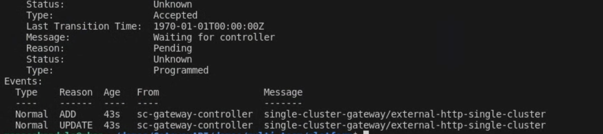
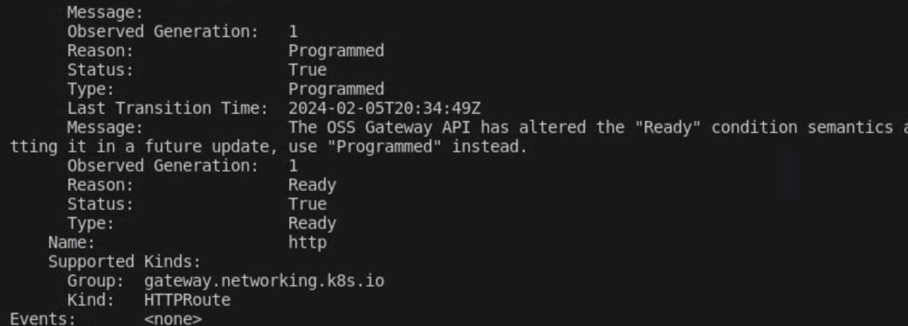
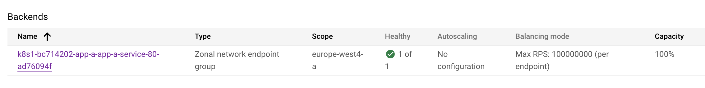

# Multi-team Global External Gateway demo
 Please note that this is **not** an official resource, so please refer to the documentation on GKE Autopilot on Google Cloud's official site.

**NOTE**: Please run the buildplatform.sh script before processing. Follow the instructions in the readme file.

## Connect to your cluster
```sh
export PROJECT_ID=<project id>
export WORKDIR=`pwd`
```
Update the **vars.sh** file to suit your environment.

```sh
gcloud config set project $PROJECT_ID
source $WORKDIR/infra/vars.sh

gcloud container clusters get-credentials ${GKE_PROD2_NAME} \
--zone ${GKE_PROD2_LOCATION} --project ${PROJECT_ID}
```

## Ensure Gateway API is installed on the cluster. 
This demo uses the regional external loadbalancer class.
First, ensure that Gateway API is enabled on the cluster by following [these](https://cloud.google.com/kubernetes-engine/docs/how-to/deploying-gateways#enable-gateway) instructions.

## Create a static ip address to be used for the gateway
This step creates a static ip-address and a certificate-map (used later).
```sh
cd $WORKDIR/demos/multi-team/platform/terraform
terraform init -backend-config="bucket=${PROJECT_ID}"
terraform plan -out=tfplan
```
Verify the infrastructure is according to plan. If so, proceed to the next step.
```sh
terraform apply tfplan
```
Take note of the IP Address generated by the terraform module.

## Deploy the gateway in the cluster

Let us create the gateway resource. This example uses the [Shared Gateway per cluster pattern](https://cloud.google.com/kubernetes-engine/docs/concepts/gateway-api#shared_gateway_per_cluster). So the platform team owns the Gateway, DNS domain, and certificates while the teams own their own namespaces, and the HTTPRoutes.

The gateway is deployed in its own namespace, in this case the *single-cluster-gateway* namespace. 
The gateway uses the class *gke-l7-global-external-managed*. 
And listens to any connections coming into port 443 (https).
Routes (we'll see later) that are deployed into namespaces that contain the label *single-cluster-gateway: "true"* are namespaces from which routes are allowed to be created on this gateway.

This way, the *single-cluster-gateway* namespace remains under the control of the platform team, while application teams can deploy httproutes in their own namespaces. The platform team can also ensure that only certain namespaces can contain the label.
There is a single listener, which listens to incoming requests with the configured hostname, protocol and port.

In this example, we use the reference the certificates we create through an annotation (yikes!) that references the certmap that holds the certificate. We use seperate certficates for different apps because the loadbalancer-type authorization used by the certificate manager cannot issue wildcard certificates. We use this method here as *google cloud endpoints* that issues our FQDN doesn't permit us to update DNS TXT records that are necessary for enabling DNS-authorization which does support wildcard certificates. The certmap referenced below (*apps-cert-map*) is created by the *demos/multi-team/platform/terraform module* used earlier in the module. The certificates themselves will be created by the terraform modules for the individual applications in later steps and are added to this certmap.

```sh
kind: Gateway
apiVersion: gateway.networking.k8s.io/v1beta1
metadata:
  name: external-http-single-cluster
  namespace: single-cluster-gateway
  annotations:
    networking.gke.io/certmap: apps-cert-map
spec:
  gatewayClassName: gke-l7-global-external-managed
  listeners:
  - name: https
    protocol: HTTPS
    port: 443
    hostname: "*.endpoints.<project id>.cloud.goog"
    allowedRoutes:
      kinds:
      - kind: HTTPRoute
      namespaces:
        from: Selector
        selector:
          matchLabels:
            single-cluster-gateway: "true"
  addresses:
  - type: NamedAddress
    value: single-cluster-gateway-address
```
NOTE: if you choose to either use a self-managed certificate or a Google Managed certificate, follow the instructions in this [page](https://cloud.google.com/kubernetes-engine/docs/how-to/secure-gateway). 
The configuration of the Gateway Listener will change slightly as you will need to include the following for a kubernetes secret that stores a self-managed certificate.
```sh
    tls:
      mode: Terminate
      certificateRefs:
      - name: <secret-name>
```
or a Google Managed certificate.
```sh
    tls:
      mode: Terminate
      options:
        networking.gke.io/pre-shared-certs: <google cert name>
```

Let's deploy this gateway. 
```sh
cd $WORKDIR/demos/multi-team/platform
kubectl apply -f ./k8s
```

Watch the gateway get deployed.
```sh
kubectl describe gtw/external-http-single-cluster -n single-cluster-gateway
```
This command should give you the events that take place to program a gateway and attach a loadbalancer. When first deployed, the gateway will be in the pending phase. . 
The gateway when "PROGRAMMED" is ready to use. 
. 

But, we will need HTTPRoutes.
The ip address should also be what we deployed using terraform.
If the output is too verbose, use the following command to see some of the information more concisely.
```sh
kubectl get gtw -n single-cluster-gateway
```
## Deploy Team A's Application

Deploy the endpoint of the form *app-a.endpoints.<project-id>.cloud.goog* by running the following terraform command.

```sh
cd $WORKDIR/demos/multi-team/team-a/infra-repo/terraform
terraform init -backend-config="bucket=${PROJECT_ID}"
terraform plan -out=tfplan
```
Verify the infrastructure is according to plan. If so, proceed to the next step. The terraform module will also create the certificate for *AppA*, called *app-a-gtw-cert* and add it to the certmap referenced by the gateway resource.

```sh
terraform apply tfplan
```
Team A's application is a web-application that renders a simple webpage.
The source code of the application is under *app/webpage* in this repo. The container image of this application can be built and pushed by running the command *./buildapp.sh* from the root of this repo. The image will be built and stored in Artifact registry under the name **europe-west4-docker.pkg.dev/<project-id>/demos/app:latest**

It is now time to deploy the application.
```sh
cd $WORKDIR/demos/multi-team/team-a/app-repo
kubectl apply -f k8s
```
The k8s folder contains all the k8s manifests required to deploy the app.
The application is parameterized with enviroment variables to give it a distinct render for team A.

Let's examine the httproute resource.
This is deployed in the *app-a* namespace that belongs to *Team A*.
This route attaches itself to the *external-http-single-cluster* gateway deployed earlier. 
This namespace (app-a) contains the required label *single-cluster-gateway: "true"* which allows the HttpRoute to attach itself to the gateway.
The route also listens for the hostname *team-a.endpoints.<project-id>.cloud.goog* by matching the Host header of HTTP request. If a request has this header, then it is forwarded to **app-a-service**'s port *80*.

```sh
apiVersion: gateway.networking.k8s.io/v1beta1
kind: HTTPRoute
metadata:
  name: app-a-route
  namespace: app-a
spec:
  hostnames:
  - app-a.endpoints.<project-id>.cloud.goog
  parentRefs:
  - name: external-http-single-cluster
    namespace: single-cluster-gateway
  rules:
  - backendRefs:
    - name: app-a-service
      port: 80
```

You can examine the events that the gateway controller is performing to attach this route by running the following command and watching the events section. 
```sh
kubectl describe httproute/app-a-route -n app-a
```
Note: This might need to be refreshed several times before the pertinent events show up. Eventually you should see events that state that binding to the gateway was successful.
After a few minutes (this does take 5 mins approx) you can navigate to *http://app-a.endpoints.<project-id>.cloud.goog* and you should see TeamA's very blue webpage. 

You can navigate to the loadbalancers in Cloud Console. You should see a single backend, with a single NEG with one healthy endpoint. 


The https endpoint usually takes a little longer (20-30 mins) to appear. This is because it takes a while for the https cert to be provisioned. You can check the status of the provisioning by running the following command.
```sh
gcloud certificate-manager certificates describe app-a-gtw-cert
```
## Deploy Team B's Application

Team B's application uses the same container image as Team A's application with a few different parameters.

Deploy the endpoint of the form *app-b.endpoints.<project-id>.cloud.goog* by running the following terraform command.  The terraform module will also create the certificate for *AppB*, called *app-b-gtw-cert* and add it to the certmap referenced by the gateway resource.

```sh
cd $WORKDIR/demos/multi-team/team-b/infra-repo/terraform
terraform init -backend-config="bucket=${PROJECT_ID}"
terraform plan -out=tfplan
```
Verify the infrastructure is according to plan. If so, proceed to the next step.
```sh
terraform apply tfplan
```
It is now time to deploy the application.

```sh
cd $WORKDIR/demos/multi-team/team-b/app-repo
kubectl apply -f k8s
```
The k8s folder contains all the k8s manifests required to deploy the app.
The application is parameterized with enviroment variables to give it a distinct render for team B.
You can examine the events that the gateway controller is performing to attach this route by running the following command and watching the events section. 
```sh
kubectl describe httproute/app-b-route -n app-b
```
This is deployed in the *app-b* namespace that belongs to *Team  B*.
This route attaches itself to the *external-http-single-cluster* gateway deployed earlier. 
This namespace (app-b) contains the required label *single-cluster-gateway: "true"* which allows the HttpRoute to attach itself to the gateway.
The route also listens for the hostname *app-b.endpoints.<project-id>.cloud.goog* by matching the Host header of HTTP request. If a request has this header, then it is forwarded to **app-b-service**'s port *80*. This way, the same gateway/loadbalancer can forward traffic to both *App A* and *App B* based on the hostname. While the *ingress* resource can also do this, this comes with the added bonus of having the resources being controlled by individual teams (platform, teamA, teamB) that they belong to without having the need to share them.

Again, wait a few minutes after deployment, and check the backend status before trying to reach team B's app.

*NOTE* It is important to note that it any time using CI/CD and automated testing might find it useful to add a delay in the execution on any automated tests in their pipeline.

## Header based routing
We're going to do some header based routing.
Let's say AppA has a new version that the team wants to allow beta-testers to use. So, users with the header "env=canary" are allowed to access the new version.  

```sh
cd $WORKDIR/demos/multi-team/team-a-version-2/app-repo
```
Let us examine the updated HTTPRoute resource.
We set the resource to route traffic to version 2 of the application when the header *env=canary* is added. 

```sh
apiVersion: gateway.networking.k8s.io/v1beta1
kind: HTTPRoute
metadata:
  name: app-a-route
  namespace: app-a
spec:
  hostnames:
  - team-a.endpoints.gateway-demos.cloud.goog
  parentRefs:
  - name: external-http-single-cluster
    namespace: single-cluster-gateway
  rules:
  - matches:
    - headers:
      - type: Exact
        name: env
        value: canary
    backendRefs:
    - name: app-a-service-version-2
      port: 80
  - backendRefs:
    - name: app-a-service-version-1
      port: 80
```
Now let's apply the new version of the HTTPRoute.

```sh
cd $WORKDIR/demos/multi-team/team-a-version-2/app-repo
kubectl apply -f k8s_headerbased
```
 After waiting a while for the new route to take effect try curling the webpage with the new header
 
 ```sh
 curl --header "env: canary" https://app-a.endpoints.<project id>.cloud.goog/
 ```
 
## Weight Based Traffic Splitting
We're going to do some traffic splitting.
AppA is past the beta testing phase and will proceed to AB testing, where version 1 is served 70% of the time and version 2 is displayed 30% of the time. This can be performed by deploying both versions and configuring the weight of each service accordingly.

Let us examine the updated HTTPRoute resource that replaces the first version of the resource we deployed.
We set the resource to route traffic to both resources at the ratio of 70:30
```sh
apiVersion: gateway.networking.k8s.io/v1beta1
kind: HTTPRoute
metadata:
  name: app-a-route
  namespace: app-a
spec:
  hostnames:
  - app-a.endpoints.gateway-demos.cloud.goog
  parentRefs:
  - name: external-http-single-cluster
    namespace: single-cluster-gateway
  rules:
  - backendRefs:
    - name: app-a-service-version-1
      port: 80
      weight: 70
    - name: app-a-service-version-2
      port: 80
      weight: 30
```
Now let's apply the new version of the HTTPRoute.

```sh
cd $WORKDIR/demos/multi-team/team-a-version-2/app-repo
kubectl apply -f k8s_weightbased
```
 After waiting a while for the new Route to take effect try curling the webpage. You should see both versions of the app appear (without the use of a header), with version 1 appearing slightly more frequently than version 2.
 ```sh
 curl https://team-a.endpoints.<project id>.cloud.goog/
 ```
After AppA version has shown to be success, the team can choose to switch the weights to 0:100 (or 0:1). That way, they can still keep version 1 alive for a while longer in case they need to revert should any issues with version 2 occur.

Let us examine the updated HTTPRoute resource that replaces the first version of the resource we deployed.
We set the resource to route traffic to both resources at the ratio of 70:30
```sh
apiVersion: gateway.networking.k8s.io/v1beta1
kind: HTTPRoute
metadata:
  name: app-a-route
  namespace: app-a
spec:
  hostnames:
  - app-a.endpoints.gateway-demos.cloud.goog
  parentRefs:
  - name: external-http-single-cluster
    namespace: single-cluster-gateway
  rules:
  - backendRefs:
    - name: app-a-service-version-1
      port: 80
      weight: 0
    - name: app-a-service-version-2
      port: 80
      weight: 1
```
Now let's apply the new version of the HTTPRoute.

```sh
cd $WORKDIR/demos/multi-team/team-a-version-2/app-repo
kubectl apply -f k8s_switch_to_v2
```
 After waiting a while for the new Route to take effect try curling the webpage. You should see only version 2 of the app appear, which version 1 is still running in the background.

## HTTPs redirect
Now, the platform team has decided to stop letting applications be served on HTTP. So, we implement a redirect to HTTPS for all HTTP calls. 
We first apply a HTTPRoute in the platform team's namespace (single-custer-gateway) that attaches itself to the HTTP listener and redirects calls to HTTPS.
```sh
apiVersion: gateway.networking.k8s.io/v1
kind: HTTPRoute
metadata:
  name: http-filter-redirect
  namespace: single-cluster-gateway
spec:
  parentRefs:
  - name: external-http-single-cluster
    sectionName: http
  rules:
  - filters:
    - type: RequestRedirect
      requestRedirect:
        scheme: https
        statusCode: 301
```
Let's apply this configuration.
```sh
cd $WORKDIR/demos/multi-team/https-redirect
kubectl apply -f 1_redirect_route.yaml
```
Let's update the HTTPRoute's of app-A and app-B so that it that attaches only to the HTTPS listener that forwards HTTPS traffic to application backends. 
Here is the updated config of app-A.
```sh
apiVersion: gateway.networking.k8s.io/v1beta1
kind: HTTPRoute
metadata:
  name: app-a-route
  namespace: app-a
spec:
  hostnames:
  - app-a.endpoints.<project id>.cloud.goog
  parentRefs:
  - name: external-http-single-cluster
    namespace: single-cluster-gateway
    sectionName: https
  rules:
  - backendRefs:
    - name: app-a-service-version-2
      port: 80
```
Let's apply the updated configuration for both app-a and app-b.
```sh
cd $WORKDIR/demos/multi-team/https-redirect
kubectl apply -f 2_httproute-app-a.yaml
kubectl apply -f 3_httproute-app-b.yaml
```
## Enable CloudArmor
We're going to use cloud armor to secure the loadbalancer.
This is created by creating a CloudArmor Security Policy and Rule and attaching it to the Backend's services.
```sh
gcloud compute security-policies create gateway-policy \
    --description "Block XSS attacks"
    
gcloud compute security-policies rules create 1000 \
    --security-policy gateway-policy \
    --expression "evaluatePreconfiguredExpr('xss-stable')" \
    --action "deny-403" \
    --description "XSS attack filtering"
```


## Clean up 
Let's remove all resources from the cluster.
```sh 
kubectl delete all --all -n app-a
kubectl delete ns app-a
kubectl delete all --all -n app-b
kubectl delete ns app-b
kubectl delete all --all -n single-cluster-gateway
kubectl delete ns single-cluster-gateway
```
Lets delete the endpoints created.
```sh
cd $WORKDIR/demos/multi-team/team-a/infra-repo/terraform
terraform init -backend-config="bucket=${PROJECT_ID}"
terraform delete --auto-approve
```
The endpoint for teamA should be deleted. Let's do the same for teamB's resources.
```sh
cd $WORKDIR/demos/multi-team/team-b/infra-repo/terraform
terraform init -backend-config="bucket=${PROJECT_ID}"
terraform delete --auto-approve
```
Finally, clean up the resources for the gateway.
```sh
cd $WORKDIR/demos/multi-team/platform/terraform
terraform init -backend-config="bucket=${PROJECT_ID}"
terraform delete --auto-approve
```
